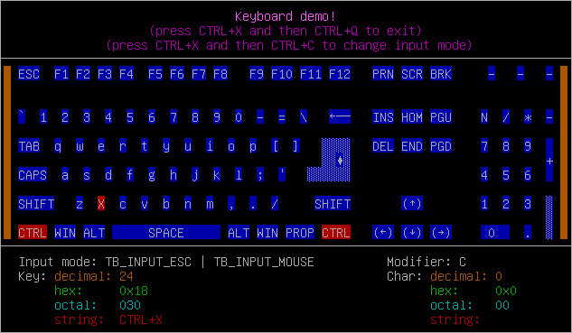

# termbox2

termbox2 is a terminal rendering library for creating TUIs. It is a
[suckless](https://suckless.org) alternative to the ubiquitous
[ncurses](https://invisible-island.net/ncurses/) library. It ships with built-in
support for popular terminals and can also fallback to terminfo if present.
Compared to the [original termbox](https://github.com/termbox/termbox), it
retains a simple API and no dependencies beyond libc, and adds stricter error
checking, more efficient escape sequence parsing, opt-in support for 32-bit
color, extended grapheme clusters, code gen for built-in escape sequences, a
test suite, and more.

termbox2 is organized as a single file header library, though it is possible to
compile it as a stand-alone shared or static library.



### Synopsis

```c
#define TB_IMPL
#include "termbox2.h"

int main(int argc, char **argv) {
    struct tb_event ev;
    int y = 0;

    tb_init();

    tb_printf(0, y++, TB_GREEN, 0, "hello from termbox");
    tb_printf(0, y++, 0, 0, "width=%d height=%d", tb_width(), tb_height());
    tb_printf(0, y++, 0, 0, "press any key...");
    tb_present();

    tb_poll_event(&ev);

    y++;
    tb_printf(0, y++, 0, 0, "event type=%d key=%d ch=%c", ev.type, ev.key, ev.ch);
    tb_printf(0, y++, 0, 0, "press any key to quit...");
    tb_present();

    tb_poll_event(&ev);
    tb_shutdown();

    return 0;
}
```

### API

The basic API is pretty self-explanatory. Consult the header file itself for the
complete API and documentation.

```c
int tb_init();
int tb_shutdown();

int tb_width();
int tb_height();

int tb_clear();
int tb_present();

int tb_set_cursor(int cx, int cy);
int tb_hide_cursor();

int tb_set_cell(int x, int y, uint32_t ch, uintattr_t fg, uintattr_t bg);

int tb_peek_event(struct tb_event *event, int timeout_ms);
int tb_poll_event(struct tb_event *event);

int tb_print(int x, int y, uintattr_t fg, uintattr_t bg, const char *str);
int tb_printf(int x, int y, uintattr_t fg, uintattr_t bg, const char *fmt, ...);
```

### How to use termbox2

As mentioned above, there are two options:

1. Copy (or `git submodule`) `termbox2.h` into your C project. As normal,
   include the header file wherever you want to use `tb_*` functions, but also
   be sure to `#define TB_IMPL` in exactly one of your source files. (This is a
   common pattern for single file header libraries.) Ensure that feature test
   macros `_DEFAULT_SOURCE` and `_XOPEN_SOURCE` are defined (either by defining
   them via compiler flags or including `termbox2.h` first[^1]).
2. Build termbox2 as a library (either `make libtermbox2.so` or
   `make libtermbox2.a`) and link as normal. Make sure the compile-time options
   remain the same for libtermbox2 and your application. (Alternatively, build
   with `make lib` and use `termbox2.h.lib` instead of `termbox2.h`. This will
   guarantee that the same `TB_LIB_OPTS`-gated compile-time options are used in
   the library and the header file.)

### Language bindings

Basic FFI or ABI-compatible examples in the languages below are in the `demo/`
directory. (Feel free to submit PRs for other languages.)

* D
* Go
* Nim
* PHP
* Python
* Ruby
* Rust
* Zig

Other wrapper libraries:

* [termbox.cr (Crystal)](https://github.com/thmisch/termbox.cr)
* [termbox2.cr (Crystal)](https://github.com/homonoidian/termbox2.cr)
* [Termbox.pm (Perl)](https://github.com/sanko/Termbox.pm)
* [termbox2-hs (Haskell)](https://github.com/gatlin/termbox2-hs)
* [termbox2-zig (Zig)](https://sr.ht/~kolunmi/termbox2-zig)
* [termbox2-node (JavaScript)](https://github.com/RauliL/termbox2-node)
* [letloop's termbox2 (Chez Scheme)](https://github.com/letloop/letloop/)
* [odin-termbox2 (Odin)](https://github.com/sudokit/odin-termbox2)

### Examples

* [mle](https://github.com/adsr/mle) - flexible terminal-based text editor
* [ictree](https://github.com/NikitaIvanovV/ictree) - like tree but interactive
* [lavat](https://github.com/AngelJumbo/lavat) - lava lamp for the terminal
* [termbox-tetris](https://github.com/zacharygraber/termbox-tetris) - Tetris clone
* [dvd-screensaver](https://github.com/yamin-shihab/dvd-screensaver) - a terminal screensaver
* [matrix-tui](https://github.com/git-bruh/matrix-tui) - Matrix client
* [Vgmi](https://github.com/RealMelkor/Vgmi) - Gemini client
* [poe](https://sr.ht/~strahinja/poe/) - `.po` file editor
* [xtxf](https://github.com/charlesrocket/xtxf) - 2D matrix screensaver

[^1]: See https://github.com/termbox/termbox2/pull/75#issuecomment-2252242269
